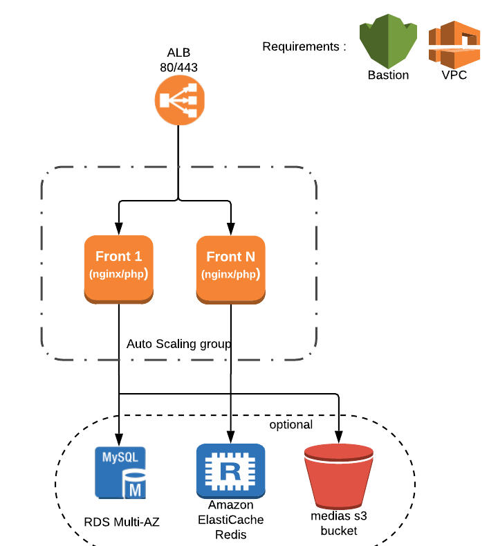
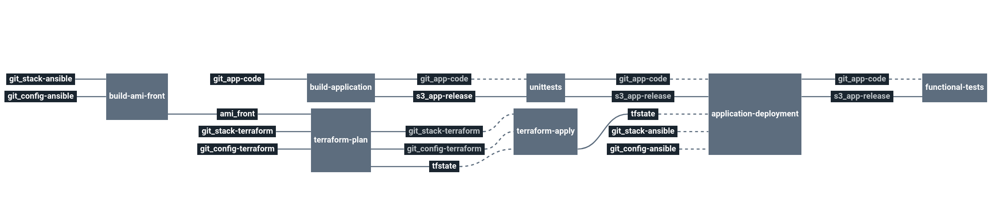

# stack-lemp (Linux, Nginx, MySQL, PHP)

This stack will create A full LEMP infrastructure based on ASG and RDS database.

  * Linux operating system
  * NGINX (Pronounced as Engine-X) web server
  * MySQL (RDS) database server
  * PHP-FPM for dynamic data processing

# Architecture

<p align="center">

</p>


  * **ALB**: Amazon application loadbalancer
  * **ASG**: Autoscaling group for fronts
  * **front**: EC2 instances from builded AMI
  * **RDS** (optional): Amazon RDS database (mysql)
  * **Elasticache** (optional): Amazon Elasticache (redis)
  * **S3 bucket** (optional): public medias bucket

# Requirements

In order to run this task, couple elements are required within the infrastructure:

  * Having a VPC with private & public subnets [Here](https://docs.aws.amazon.com/vpc/latest/userguide/getting-started-ipv4.html#getting-started-create-vpc)
  * Having a bastion server to run Ansible like described [Here](https://docs.cycloid.io/advanced-guide/ansible-integration.html#standard-usage)
  * Having an S3 bucket to store Terraform remote states [Here](https://docs.aws.amazon.com/quickstarts/latest/s3backup/step-1-create-bucket.html)
  * Having an S3 bucket for website code **WITH** versioning enable [Here](https://docs.aws.amazon.com/quickstarts/latest/s3backup/step-1-create-bucket.html)


# Details

## Pipeline

> **Note** The pipeline contains a manual approval between terraform plan and terraform apply.
> That means if you trigger a terraform plan, to apply it, you have to go on terraform apply job
> and click on the `+` button to trigger it.



**Jobs description**

  * `build-worker-ami` : Build Front Amazon image AMI using Packer and Ansible.
  * `build-application`: Runs the appropriate php/composer commands and build a release file of the code to put it on S3.
  * `unittest`: Dummy job meant to eventually be replaced by proper tests or removed.
  * `terraform-plan`: Terraform job that will simply make a plan of the stack.
  * `terraform-apply`: Terraform job similar to the plan one, but will actually create/update everything that needs to. Please see the plan diff for a better understanding.
  * `application-deployment`: Simply trigger a deployment using Ansible of the last version of the code on existing instances.
  * `functional-tests`: Dummy job meant to eventually be replaced by proper functional or removed.
  * `terraform-destroy`: :warning: Terraform job meant to destroy the whole stack - **NO CONFIRMATION ASKED**. If triggered, the full project **WILL** be destroyed. Use with caution.

**Params**

|Name|Description|Type|Default|Required|
|---|---|:---:|:---:|:---:|
|`ansible_vault_password`|Password used by ansible vault to decrypt your vaulted files.|`-`|`((raw_ansible_vault_password))`|`True`|
|`aws_access_key`|Amazon AWS access key for Terraform. see value format [Here](https://docs.cycloid.io/advanced-guide/integrate-and-use-cycloid-credentials-manager.html#vault-in-the-pipeline)|`-`|`((aws.access_key))`|`True`|
|`aws_default_region`|Amazon AWS region to use for Terraform.|`-`|`eu-west-1`|`True`|
|`aws_secret_key`|Amazon AWS secret key for Terraform. see value format [Here](https://docs.cycloid.io/advanced-guide/integrate-and-use-cycloid-credentials-manager.html#vault-in-the-pipeline)|`-`|`((aws.secret_key))`|`True`|
|`bastion_private_key_pair`|bastion SSH private key used by ansible to connect on aws ec2 instances and the bastion itself.|`-`|`((ssh_bastion.ssh_key))`|`True`|
|`bastion_url`|bastion url used by ansible to connect on aws ec2 instances.|`-`|`admin@bastion.cycloid.io`|`True`|
|`config_ansible_path`|Path of Ansible files in the config git repository|`-`|`($ project $)/ansible`|`True`|
|`config_git_branch`|Branch of the config git repository.|`-`|`master`|`True`|
|`config_git_private_key`|SSH key pair to fetch the config git repository.|`-`|`((git_config.ssh_key))`|`True`|
|`config_git_repository`|Git repository url containing the config of the stack.|`-`|`git@github.com:MyUser/config-lemp-app.git`|`True`|
|`config_terraform_path`|Path of Terraform files in the config git repository|`-`|`($ project $)/terraform/($ environment $)`|`True`|
|`customer`|Name of the Cycloid Organization, used as customer variable name.|`-`|`($ organization_canonical $)`|`True`|
|`deploy_bucket_name`|AWS S3 bucket name in which store the builded code of the website.|`-`|`($ project $)-deploy`|`True`|
|`deploy_bucket_object_path`|AWS S3 bucket path in which store the builded code of the website.|`-`|`/catalog-lemp-app/($ environment $)/lemp-app.tar.gz`|`True`|
|`env`|Name of the project's environment.|`-`|`($ environment $)`|`True`|
|`lemp_git_branch`|Branch of the lemp source code git repository.|`-`|`master`|`True`|
|`lemp_git_private_key`|SSH key pair to fetch lemp source code git repository.|`-`|`((git_lemp_app.ssh_key))`|`True`|
|`lemp_git_repository`|Url to the git repository containing lemp website source code.|`-`|`git@github.com:MyUser/code-lemp.git`|`True`|
|`project`|Name of the project.|`-`|`($ project $)`|`True`|
|`rds_password`|Password used for your rds. Set "empty" if you dont use databases|`-`|`((raw_rds_password))`|`False`|
|`stack_git_branch`|Branch to use on the public stack git repository|`-`|`master`|`True`|
|`terraform_storage_bucket_name`|AWS S3 bucket name to store terraform remote state file.|`-`|`($ organization_canonical $)-terraform-remote-state`|`True`|
|`terraform_storage_bucket_path`|AWS S3 bucket path to store terraform remote state file.|`-`|`($ project $)/($ environment $)`|`True`|


## Terraform

**Inputs**

|Name|Description|Type|Default|Required|
|---|---|:---:|:---:|:---:|
|`application_ssl_cert`|ARN of an Amazon cert (ACM) to use for the loadbalancer.|`-`|``|`False`|
|`bastion_sg_allow`|Amazon source security group ID which will be allowed to connect on Fronts port 22 (ssh).|`-`|``|`False`|
|`cache_subnet_group`|Name os the Amazon elasticache subnet group to use. If not specified, create a dedicated group with private_subnets_ids.|`-`|``|`False`|
|`create_elasticache`||`bool`|`true`|`False`|
|`create_rds`|Define if we want to create or not a RDS database.|`bool`|`false`|`False`|
|`create_s3_medias`|Create a S3 bucket dedicated to medias for the LEMP application|`bool`|`false`|`False`|
|`elasticache_engine`|Type of the elasticache engine|`-`|`redis`|`False`|
|`elasticache_engine_version`|Version of the Elasticache engine|`-`|`5.0.0`|`False`|
|`elasticache_nodes`|Number of nodes in the elasticache cluster.|`-`|`1`|`False`|
|`elasticache_parameter_group_name`|Elasticache group parameter name to use.|`-`|`default.redis5.0`|`False`|
|`elasticache_port`|Port of the elasticache|`-`|`6379`|`False`|
|`elasticache_type`|Instance size to use for elasticache nodes.|`-`|`cache.t2.micro`|`False`|
|`front_asg_max_size`|Maximum number of front server allowed in the AutoScaling group.|`-`|`5`|`False`|
|`front_count`|Desired number of front servers|`-`|`1`|`False`|
|`front_disk_size`|Disk size of front servers.|`-`|`30`|`False`|
|`front_ebs_optimized`|Whether the Instance is EBS optimized or not, related to the instance type you choose.|`bool`|`false`|`False`|
|`front_type`|Type of instance to use for front servers|`-`|`t3.small`|`False`|
|`keypair_name`|SSH keypair name to use to deploy ec2 instances.|`-`|`cycloid`|`False`|
|`metrics_sg_allow`|Additionnal security group ID to assign to Cycloid workers. Goal is to allow monitoring server to query metrics.|`-`|`""`|`False`|
|`private_subnets_ids`|Amazon subnets IDs on which create each components.|`array`|``|`True`|
|`public_subnets_ids`|Amazon subnets IDs on which create each components.|`array`|``|`True`|
|`rds_backup_retention`|The days to retain backups for. Must be between 0 and 35. When creating a Read Replica the value must be greater than 0|`-`|`7`|`False`|
|`rds_database`|RDS database name.|`-`|`application`|`False`|
|`rds_disk_size`|RDS disk size.|`-`|`10`|`False`|
|`rds_engine`|RDS database engine to use.|`-`|`mysql`|`False`|
|`rds_engine_version`|The version of the RDS database engine|`-`|`5.7.16`|`False`|
|`rds_multiaz`|If the RDS instance is multi AZ enabled.|`bool`|`false`|`False`|
|`rds_parameters`|Name of the RDS parameters group to use.|`-`|`default.mysql5.7`|`False`|
|`rds_password`|RDS password. expected value is "${var.rds_password}" to get it from the pipeline.|`-`|`ChangeMePls`|`False`|
|`rds_subnet_group`|RDS subnet group name to use. If not specified, create a dedicated group with private_subnets_ids.|`-`|``|`False`|
|`rds_type`|RDS database instance size.|`-`|`db.t3.small`|`False`|
|`rds_username`|RDS database username.|`-`|`application`|`False`|
|`vpc_id`|Amazon VPC id on which create each components.|`-`|``|`True`|

**Outputs**

| Name | Description |
|------|-------------|
| alb_front_dns_name | DNS name of the front alb. |
| alb_front_zone_id | Zone ID of the front alb. |
| elasticache_address | Address of the elasticache. |
| iam_s3-medias_user_key | Access key of the dedicated IAM user to access to the media S3 bucket. |
| iam_s3-medias_user_secret | Access secret key of the dedicated IAM user to access to the media S3 bucket. |
| rds_address | Address of the RDS database. |
| rds_database | Database name of the RDS database. |
| rds_port | Port of the RDS database. |
| rds_username | Username of the RDS database. |
| s3_medias | S3 bucket name dedicated to medias. |


## Ansible

  * Playbook and packer config to build a debian image with telegraf, fluentd, nginx and php-fpm installed

|Name|Description|Type|Default|Required|
|---|---|:---:|:---:|:---:|
|`cycloid_files_watched`|Provide log files you want to export to Cycloid logs.|`-`|`<Default log files watched>`|`False`|
|`nginx_sites`|Contain Nginx vhosts to create on front servers. A default application and metrics vhosts are already provided.|`dict`|`<metric and application vhost>`|`False`|
|`php_version_to_install`|PHP fpm version to install.|`-`|`7.2`|`False`|

# Molecule tests

Requires a bucket which contains a build of magento sources and AWS access key

virtualenv if needed
```
virtualenv    .env  --clear
source .env/bin/activate

pip install ansible==2.7
pip install molecule
pip install docker-py
```

Run the test
```
cd ansible

export AWS_SECRET_ACCESS_KEY=AKI...
export AWS_ACCESS_KEY_ID=....

export DEPLOY_BUCKET_NAME=cycloid-deploy
export DEPLOY_BUCKET_OBJECT_PATH=catalog-lemp-app/ci/lemp-app.tar.gz
export DEPLOY_BUCKET_REGION=eu-west-1

# Run molecule
molecule destroy
molecule converge
molecule verify
```

